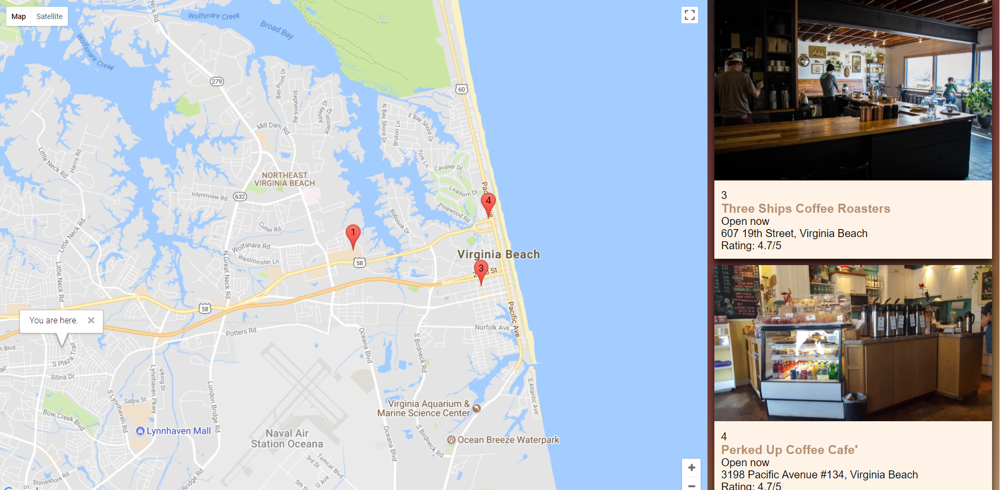
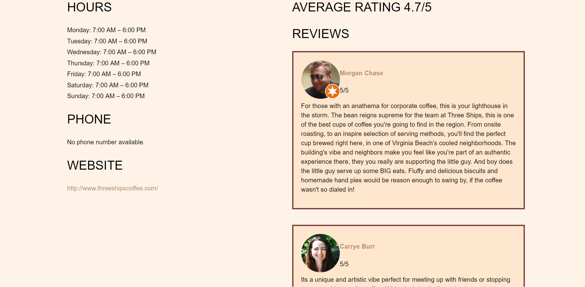

# Roaster Nexus

## Table of Contents
+ [Summary](https://github.com/chrstntdd/roaster-nexus/#summary/)
+ [Technology](https://github.com/chrstntdd/roaster-nexus/#technology)
+ [Screenshots](https://github.com/chrstntdd/roaster-nexus/#screenshots)

### Summary
Web app to connect coffee lovers to local coffee roasters.

### Technology

+ HTML
+ SASS / CSS
+ Javascript (mostly jQuery)
+ Google Maps API

### Screenshots

  </img>
  </img>
  </img>
  </img>
  </img>

